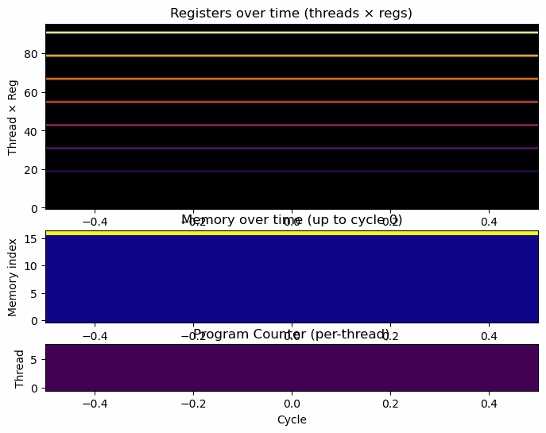
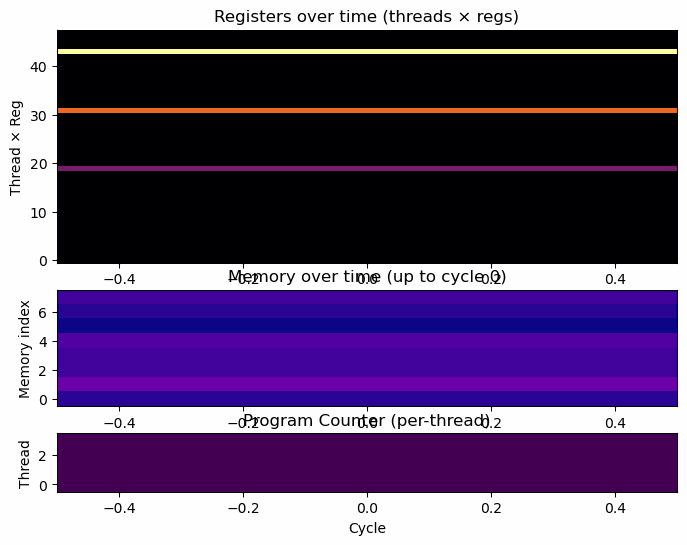

<div align="center">

# TinyGPU 🐉⚡  

[](https://pypi.org/project/tinygpu)
[](https://www.python.org/downloads/)
[](LICENSE)
[](https://github.com/deaneeth/tinygpu/actions)

TinyGPU is a **tiny educational GPU simulator** - inspired by [Tiny8](https://github.com/sql-hkr/tiny8), designed to demonstrate how GPUs execute code in parallel. It models a small **SIMT (Single Instruction, Multiple Threads)** system with per-thread registers, global memory, synchronization barriers, branching, and a minimal GPU-like instruction set.

> 🎓 *Built for learning and visualization - see how threads, registers, and memory interact across cycles!*



</div>
---

## 💡 Why TinyGPU?

TinyGPU was built as a **learning-first GPU simulator** - simple enough for beginners, but powerful enough to illustrate real GPU execution concepts like threads, synchronization, and divergence.

- ⚡ **Lightweight:**  
  Zero heavy dependencies - runs entirely in Python with clean, readable code.
- 🧩 **Educational:**  
  Demonstrates GPU fundamentals: thread execution, shared memory, branching, and synchronization barriers.
- 🔁 **Fast feedback loop:**  
  Write a `.tgpu` file, run it, and instantly visualize how your threads interact.
- 🧠 **Extensible:**  
  Add your own instructions, modify architecture parameters, or visualize new metrics.
- 🎨 **Visual clarity:**  
  Each program can be rendered as a heatmap or exported as a GIF - perfect for teaching and demos.

---

## 👥 Who Should Use It?

- 🧑‍🎓 **Students** - learn GPU basics through hands-on examples.  
- 👩‍🏫 **Educators** - build step-by-step visual lessons about parallel computing.  
- 🧑‍🔬 **Researchers & hobbyists** - prototype kernel logic or explore synchronization models.  
- 💡 **Developers** - experiment with SIMD-style concepts without real GPU dependencies.

---

## 🚦 Get Started

1. **Install & run locally** - see the [Quickstart](#-quickstart) section below.  
2. **Explore the examples** - try `vector_add`, `odd_even_sort`, and `reduce_sum` kernels.  
3. **Visualize execution** - watch registers, memory, and threads evolve in real-time.  
4. **Experiment!** - tweak instruction behavior or add your own to understand how GPUs schedule and synchronize work.

> 🧭 TinyGPU aims to make GPU learning *intuitive, visual, and interactive* - from classroom demos to self-guided exploration.

---
## ✨ Highlights

- 🧩 **GPU-like instruction set:**  
  `SET`, `ADD`, `MUL`, `LD`, `ST`, `JMP`, `BNE`, `BEQ`, `SYNC`, `CSWAP`.
- 🧠 **Per-thread registers & PCs** - each thread executes the same kernel independently.
- 🧱 **Shared global memory** for inter-thread operations.
- 🔄 **Synchronization barriers** (`SYNC`) for parallel coordination.
- 🎨 **Visualizer & GIF exporter** - view execution as heatmaps or export to animated GIFs.
- 🧮 **Example kernels included:**
  - Vector addition  
  - Odd-even sort (GPU-style bubble sort)  
  - Parallel reduction (sum of array)  
  - Loop test & synchronization demo  

---

## 🖼️ Example Visuals

> Located in `examples/` — you can generate these GIFs yourself.

| Odd-Even Sort | Reduction |
|---------------|------------|
|  |  |

---

## 🚀 Quickstart

### Clone and install
```bash
git clone https://github.com/deaneeth/tinygpu.git
cd tinygpu
pip install -e .
pip install -r requirements-dev.txt
````

### Run an example

```bash
python -m examples.run_odd_even_sort
```

> Produces: `examples/odd_even_sort.gif` — a visual GPU-style sorting process.

### Other examples

```bash
python -m examples.run_vector_add
python -m examples.run_reduce_sum
python -m examples.run_test_loop
python -m examples.run_sync_test
```

---

## 🧩 Project Layout

```
tinygpu/
├─ examples/
│  ├─ vector_add.tgpu
│  ├─ odd_even_sort.tgpu
│  ├─ reduce_sum.tgpu
│  ├─ run_vector_add.py
│  ├─ run_odd_even_sort.py
│  ├─ run_reduce_sum.py
│  ├─ run_test_loop.py
│  └─ run_sync_test.py
│
├─ src/
│  └─ tinygpu/
│     ├─ assembler.py
│     ├─ gpu.py
│     ├─ instructions.py
│     ├─ visualizer.py
│     └─ __init__.py
│
├─ tests/
├─ pyproject.toml
├─ requirements-dev.txt
└─ README.md
```

---

## 🧠 Assembly Reference (Mini ISA)

TinyGPU uses a **minimal instruction set** designed for clarity and education - simple enough for beginners, but expressive enough to build realistic GPU-style kernels.

| **Instruction**             | **Operands**                            | **Description** |
|-----------------------------|------------------------------------------|-----------------|
| `SET Rd, imm`               | `Rd` = destination register, `imm` = immediate value | Set register `Rd` to an immediate constant. |
| `ADD Rd, Ra, Rb`            | `Rd` = destination, `Ra` + `Rb` | Add two registers and store result in `Rd`. |
| `ADD Rd, Ra, imm`           | `Rd` = destination, `Ra` + immediate | Add register and immediate value. |
| `MUL Rd, Ra, Rb`            | Multiply two registers. | `Rd = Ra * Rb` |
| `MUL Rd, Ra, imm`           | Multiply register by immediate. | `Rd = Ra * imm` |
| `LD Rd, addr`               | Load from memory address into register. | `Rd = mem[addr]` |
| `LD Rd, Rk`                 | Load from address in register `Rk`. | `Rd = mem[Rk]` |
| `ST addr, Rs`               | Store register into memory address. | `mem[addr] = Rs` |
| `ST Rk, Rs`                 | Store value from `Rs` into memory at address in register `Rk`. | `mem[Rk] = Rs` |
| `JMP target`                | Label or immediate. | Unconditional jump — sets PC to `target`. |
| `BEQ Ra, Rb, target`        | Branch if equal. | Jump to `target` if `Ra == Rb`. |
| `BNE Ra, Rb, target`        | Branch if not equal. | Jump to `target` if `Ra != Rb`. |
| `SYNC`                      | *(no operands)* | Synchronization barrier — all threads must reach this point before continuing. |
| `CSWAP addrA, addrB`        | Compare-and-swap memory values. | If `mem[addrA] > mem[addrB]`, swap them. Used for sorting. |
| `CMP Rd, Ra, Rb` *(optional)* | Compare and set flag or register. | Used internally for extended examples (e.g., prefix-scan). |
| `NOP` *(optional)*          | *(no operands)* | No operation; placeholder instruction. |

---

### 💡 Notes & Conventions

- **Registers:**  
  - Each thread has its own register file (`R0`–`R7` or more depending on configuration).  
  - `R7` is automatically initialized to the thread ID (`tid`).
- **Memory:**  
  - Global memory is shared between all threads.
  - Addresses can be immediate (`16`) or register-based (`R2`).
- **Labels & Comments:**  
  - Use labels like `loop:` for jumps.
  - Comments start with `;`.
- **Synchronization:**  
  - Use `SYNC` when threads must finish a phase before the next (e.g., sorting or reduction).
- **Execution:**  
  - Each instruction executes per-thread.
  - Threads can branch independently (SIMT divergence is handled via per-thread PCs).

---

## 🧮 Example: Odd-Even Sort Kernel

```asm
SET R0, 0        ; phase_counter
SET R1, 8        ; num_phases == N (set to array length here, adjust in runner)
SET R3, 0        ; parity (0 = even phase, 1 = odd phase)

loop_phase:
    ; compute base index = tid * 2
    MUL R4, R7, 2      ; R4 = tid * 2
    ADD R5, R4, R3     ; R5 = index = tid*2 + parity
    ADD R6, R5, 1      ; R6 = index + 1
    CSWAP R5, R6       ; compare & swap memory[index], memory[index+1]
    SYNC               ; synchronize threads across the phase

    ADD R3, R3, 1      ; parity = parity + 1
    BNE R3, 2, noreset
    SET R3, 0
noreset:
    ADD R0, R0, 1
    BNE R0, R1, loop_phase

done:
    JMP done
```

---

## 🧩 Writing & Running Programs

1. Write your `.tgpu` assembly file in `examples/`.

2. Assemble and run it in Python:

   ```python
   from src.tinygpu.assembler import assemble_file
   from src.tinygpu.gpu import TinyGPU

   prog, labels = assemble_file("examples/vector_add.tgpu")
   gpu = TinyGPU(num_threads=8, num_registers=8, mem_size=64)
   gpu.load_program(prog, labels)
   gpu.run(max_cycles=100)
   ```

3. Visualize the run:

   ```python
   from src.tinygpu.visualizer import visualize
   visualize(gpu, show_pc=True)
   ```

4. Export as GIF:

   ```python
   from src.tinygpu.visualizer import save_animation
   save_animation(gpu, out_path="examples/my_run.gif", fps=10, max_frames=200)
   ```

---

## 🧰 Development & Testing

Run tests:

```bash
pytest
```

Run linters:

```bash
ruff .
black --check src/ tests/
```

CI builds and runs tests automatically on push/pull.

---

## 📘 License

MIT - see [LICENSE](LICENSE)

---

## 🌟 Credits & Inspiration

❤️ Built by [Deaneeth](https://github.com/deaneeth) 

> Inspired by the educational design of [Tiny8 CPU Simulator](https://github.com/sql-hkr/tiny8).

TinyGPU extends these ideas into the world of **parallel GPU computing**, emphasizing **clarity, simplicity, and visualization** for all learners.
