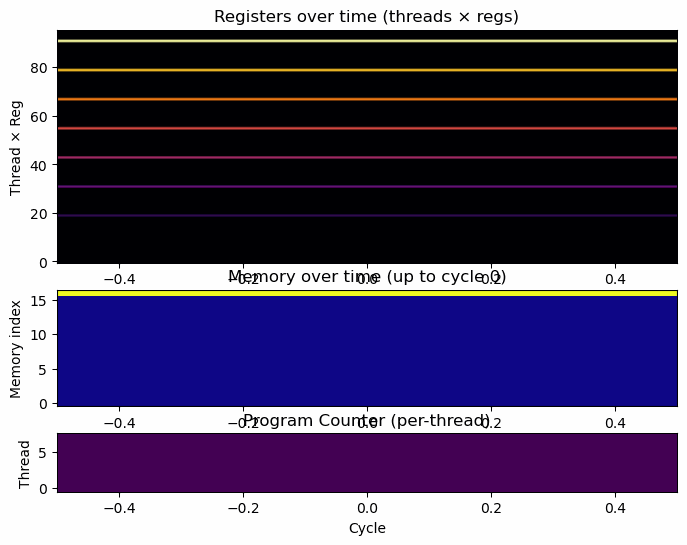

# TinyGPU 🐉⚡ — v2.0.0

[](https://github.com/deaneeth/tinygpu/releases/tag/v2.0.0)
[](https://www.python.org/downloads/)
[](LICENSE)
[](https://github.com/deaneeth/tinygpu/actions)
[](https://github.com/deaneeth/tinygpu/actions)
[](https://github.com/psf/black)

TinyGPU is a **tiny educational GPU simulator** — a minimal SIMT-style simulator with:

- Per-thread registers & program counters
- Shared global memory and per-block shared memory
- A small GPU-style ISA and assembler
- Visualizer and GIF export for educational animations

> 🎓 *Built for learning and visualization - see how threads, registers, and memory interact across cycles!*

---

## 🚀 What's New in v2.0.0

- **Enhanced Instruction Set**:
  - Added `SHLD` and `SHST` for robust shared memory operations.
  - Improved `SYNC` semantics for better thread coordination.
- **Visualizer Improvements**:
  - Export execution as GIFs with enhanced clarity.
  - Added support for saving visuals directly from the simulator.
- **Refactored Core**:
  - Simplified step semantics for better extensibility.
  - Optimized performance for larger thread counts.
- **CI/CD Updates**:
  - Integrated linting (`ruff`, `black`) and testing workflows.
  - Automated builds and tests on GitHub Actions.
- **Documentation**:
  - Expanded examples and added detailed usage instructions.

---

## Quick Screenshots / Demos

### Odd–Even Transposition Sort



### Parallel Reduction (Sum)


---

## Getting Started

Clone and install (editable):

```bash
git clone https://github.com/deaneeth/tinygpu.git
cd tinygpu
pip install -e .
pip install -r requirements-dev.txt
```

Run a demo (odd-even sort):

```bash
python -m examples.run_odd_even_sort
```

> Produces: `outputs/run_odd_even_sort/run_odd_even_sort_*.gif` — a visual GPU-style sorting process.

---

## Examples & Runners

- `examples/run_vector_add.py` — simple parallel vector add
- `examples/run_vector_add_kernel.py` — vector add with kernel arguments
- `examples/run_test_loop.py` — branch/loop test (sum 1..4)
- `examples/run_test_cmp.py` — comparison and branching test
- `examples/run_test_kernel_args.py` — kernel arguments test
- `examples/run_odd_even_sort.py` — odd-even transposition sort (GIF)
- `examples/run_reduce_sum.py` — parallel reduction (GIF)
- `examples/run_block_shared_sum.py` — per-block shared memory example
- `examples/run_sync_test.py` — synchronization test
- `examples/debug_repl.py` — interactive REPL debugger

---

## Instruction Set (Quick Reference)

| **Instruction**             | **Operands**                            | **Description** |
|-----------------------------|------------------------------------------|-----------------|
| `SET Rd, imm`               | `Rd` = destination register, `imm` = immediate value | Set register `Rd` to an immediate constant. |
| `ADD Rd, Ra, Rb`            | `Rd` = destination, `Ra` + `Rb` | Add two registers and store result in `Rd`. |
| `ADD Rd, Ra, imm`           | `Rd` = destination, `Ra` + immediate | Add register and immediate value. |
| `MUL Rd, Ra, Rb`            | Multiply two registers. | `Rd = Ra * Rb` |
| `MUL Rd, Ra, imm`           | Multiply register by immediate. | `Rd = Ra * imm` |
| `LD Rd, addr`               | Load from memory address into register. | `Rd = mem[addr]` |
| `LD Rd, Rk`                 | Load from address in register `Rk`. | `Rd = mem[Rk]` |
| `ST addr, Rs`               | Store register into memory address. | `mem[addr] = Rs` |
| `ST Rk, Rs`                 | Store value from `Rs` into memory at address in register `Rk`. | `mem[Rk] = Rs` |
| `SHLD Rd, saddr`            | Load from shared memory into register. | `Rd = shared_mem[saddr]` |
| `SHST saddr, Rs`            | Store register into shared memory. | `shared_mem[saddr] = Rs` |
| `CSWAP addrA, addrB`        | Compare-and-swap memory values. | If `mem[addrA] > mem[addrB]`, swap them. Used for sorting. |
| `CMP Ra, Rb`                | Compare and set flags. | Set Z/N/G flags based on `Ra - Rb`. |
| `BRGT target`               | Branch if greater. | Jump to `target` if G flag set. |
| `BRLT target`               | Branch if less. | Jump to `target` if N flag set. |
| `BRZ target`                | Branch if zero. | Jump to `target` if Z flag set. |
| `JMP target`                | Label or immediate. | Unconditional jump — sets PC to `target`. |
| `SYNC`                      | *(no operands)* | Global synchronization barrier — all threads must reach this point. |
| `SYNCB`                     | *(no operands)* | Block-level synchronization barrier. |

---

## Publishing & Contributing

- See `.github/workflows/ci.yml` for CI and packaging
- To propose changes, open a PR. For bug reports, open an issue.

---

## License

MIT — See [LICENSE](../LICENSE).
